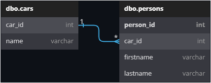
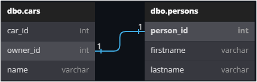

# I. Introduction

> **Warning**
> This project is at the "preview" stage, which is why it is not recommended to use it in a production environment. In addition, some major changes may occur between two minor versions. 

LazySql is a micro ORM that aims to facilitate access to a SQL-Server database.

# II. Summary

- [I. Introduction](#i-introduction)
- [II. Last Release Note](#ii-last-release-note)
- [III. Prerequisites](#iii-prerequisites)
- [IV. Limitations](#iv-limitations)
- [V. Installation](#v-installation)
- [VI. How to use it?](#vi-how-to-use-it)
   - [A. Different object types supported](#a-different-object-types-supported)
   - [B. Initialization of LazySql](#b-initialization-of-lazysql)
   - [C. Working with Objects implementing the LazyBase class](#c-working-with-objects-implementing-the-lazybase-class)
       - [C.1. LazyTable Attribute](#c1-lazytable-attribute)
       - [C.2. PrimaryKey Attribute](#c2-primarykey-attribute)
       - [C.3. LazyColumn Attribute](#c3-lazycolumn-attribute)
       - [C.4. Relations](#c4-relations)
          - [C.4.a. Relation 1 <=> 0,n](#c4a-relation-1--0n)
          - [C.4.b. Relation 1 <=> 0,1](#c4b-relation-1--01)
       - [C.5. Select with LazyBase Object](#c5-select-with-lazybase-object)
       - [C.6. Insert with LazyBase Object](#c6-insert-with-lazybase-object)
       - [C.7. Update with LazyBase Object](#c7-update-with-lazybase-object)
       - [C.8. Delete with LazyBase Object](#c8-delete-with-lazybase-object)
    - [D. Working with Objects](#d-working-with-object)
        - [D.1. Select with Object](#d1-select-with-object)
        - [D.2. Insert with Object](#d2-insert-with-object)
        - [D.3. Update with Object](#d3-update-with-object)
        - [D.4. Delete with Object](#d4-delete-with-object)
    - [E. Working with dynamic](#e-working-with-dynamic)
        - [E.1. Select with dynamic](#e1-select-with-dynamic)
        - [E.2. Insert with dynamic](#e2-insert-with-dynamic)
        - [E.3. Update with dynamic](#e3-update-with-dynamic)
        - [E.4. Delete with dynamic](#e4-delete-with-dynamic)
    - [F. Stored Procedures](#f-stored-procedures)
    - [G. Bulk Insert](#g-bulk-insert)
    - [H. Other Queries](h-#other-queries)
        - [H.1. ExecuteNonQuery](#h1-executenonquery)
        - [H.2. ExecuteScalar](#h2-executescalar)
    - [I. Use Expressions](#use-expressions)
- [VII. Previous Release Notes](#vii-previous-release-notes)
- [VIII. Licence](#vii-previous-release-notes)

# II. Last Release Note

## 2.2.0-preview

* Support of Schemas
* Improving Expression
* Review methods
* Documentation!
* Write queries ``"Id = @id".Bind("@Id", 1)`` instead of ``new SqlQuery("Id = @id").Bind("@Id", 1)``

> **Note**
> For previous release notes: [VII. Previous Release Notes](#vii-previous-release-notes)

# III. Prerequisites

## .NET

|             | **.NET** | **.NET Framework** | **.NET Standard** |
|-------------|:-------------:|:------------------:|:-----------------:|
| **Version** |      6.0      |         4.8        |        2.0        |

## Sql Server

Minimum version: Sql Server 2012

# IV. Limitations

Due to its simplified design, certain types of queries cannot be performed (such as joins). In addition, transactions are not supported.

Voici les fonctionnalités implémentées:

| **Type of query**                             | **Supported** | **Comment**          |
|-----------------------------------------------|:-------------:|----------------------|
| **Standard queries (SELECT, UPDATE, DELETE)** |       🟢       |                     |
| **Bulk Insert**                               |       🟢       |                     |
| **Stored Procedures**                         |       🟢       |                     |
| **Views**                                     |       🔴       |                     |
| **User-Defined SQL Functions**                |       🔴       | Nothing planned      |

## Data Types

| **Data Type**                  | **Supported** | **C# Property Type**     |
|--------------------------------|:-------------:|-----------------|
| ``bigint``                         |       🟢      | ``long``            |
| ``numeric``                        |       🟢      | ``decimal``                |
| ``bit``                            |       🟢      | ``bool``          |
| ``smallint``                       |       🟢      | ``short``                |
| ``decimal``                        |       🟢      | ``decimal``                |
| ``smallmoney``                     |       🟢      | ``decimal``                |
| ``int``                            |       🟢      | ``int``                |
| ``tinyint``                        |       🟢      | ``byte``                |
| ``money``                          |       🟢      | ``decimal``                |
| ``float``                          |       🟢      | ``double``                |
| ``real``                           |       🟢      | ``single``                |
| ``date``                           |       🟢      | ``DateTime``          |
| ``datetimeoffset``                 |       🟢      | ``DateTimeOffset``                |
| ``datetime2``                      |       🟢      | ``DateTime``                |
| ``smalldatetime``                  |       🟢      | ``DateTime``                |
| ``datetime``                       |       🟢      | ``DateTime``                |
| ``time``                           |       🟢      | ``TimeSpan``                |
| ``char``                           |       🟢      | ``string``           |
| ``varchar``                        |       🟢      | ``string``                |
| ``text``                           |       🟢      | ``string``                |
| ``nchar``                          |       🟢      | ``string``                |
| ``nvarchar``                       |       🟢      | ``string``                |
| ``ntext``                          |       🟢      | ``string``                |
| ``binary``                         |       🟢      | ``byte[]``            |
| ``varbinary``                      |       Nothing planned      |                 |
| ``image``                          |       🟢      | ``byte[]``                |
| ``hierarchyid``                    |          Nothing planned      |  |
| ``uniqueidentifier``               |       🟢      | ``Guid``                |
| ``xml``                            |       🟢      | ``string``                |
| ``Spatial Geometry Types``         |       Nothing planned      |  |
| ``Spatial Geography Types``        |       Nothing planned      |  |


Here are the supported functions: [Sql Functions](#sql-functions)


# V. Installation

|  NuGet |  Downloads |
|  ----- | ---------- |
| [](https://www.nuget.org/packages/LazySqlStandard.Engine/) | [](https://www.nuget.org/packages/LazySqlStandard.Engine/) |

# VI. How to use it?

Here is an example of code to retrieve all cars with an Id less than 10 and update them.

```cs
LazyClient.Initialize("Server=my-server\SQL2019;Database=MyDataBase;");

foreach (Car car in LazyClient.Select<Car>().Where(c=>c.Id < 10) {
   car.UpdateDate = DateTime.Now;
   car.Update();
}
```

It's simple, right? As you can see, you can write your queries in Linq (or Expression), and LazySql will translate them into SQL 💪🏽.

## A. Different object types supported

You can use LazySql with classes, records or dynamic type, the engine uses the properties (which must be public) to read or write values.

However, just using objects can cause problems with using primary keys for example (in order to update or delete the object), or you may want to rename the columns differently in your C# code. This is why you can implement the ``LazyBase`` class and the attributes dedicated to mapping and defining primary keys.

You can mix the types you are going to use in your project (e.g. a dynamic type, an object type or an object type that derives from ``LazyBase``).

## B. Initialization of LazySql

Before using LazySql, you must initialise it with the SQL connection string:

```cs
LazyClient.Initialize("Server=my-server\SQL2019;Database=MyDataBase;");
```

You only need to do this once because LazySql is a singleton. In case of doubt, you can check if it has already been intialised or not with the property ``Initialized``:

```cs
if (!LazyClient.Initialized)
    LazyClient.Initialize("Server=my-server\SQL2019;Database=MyDataBase;");
```

You should know that LazySql uses a cache to keep in memory the structure of your objects, that's why it is advised to declare them in the ``Initialize`` method of ``LazyClient`` and adding the type of your objects in argument ( please note that the dynamic type is not supported at the initialization):

```cs
if (!LazyClient.Initialized)
    LazyClient.Initialize("Server=my-server\SQL2019;Database=MyDataBase;", typeof(Car), typeof(Person), typeof(Account));
```

That's it for the initialization. Don't worry about opening the database connection, this is handled automatically by LazySql. 

## C. Working with Objects implementing the LazyBase class

As described above, the implementation of the LazyBase class allows you to define the table name, column names, primary keys, and parent/child relationship.

Here is an example that summarises a configuration with all possible attributes.

```cs
[LazyTable("Cars")]
public class Car : LazyBase
{
    [LazyColumn("car_id", SqlType.Int)]
    [PrimaryKey(true)]
    public int Id { get; set; }

    [LazyColumn(SqlType.VarChar)]
    public string Brand { get; set; }

    [LazyColumn(SqlType.VarChar)]
    public string Model { get; set; }

    [LazyColumn("owner_id", SqlType.VarChar)]
    public string OwnerId { get; set; }

    public List<Person> Passengers { get; set; }
    
    public Person Owner { get; set; }

    public override void InitializeTable()
    {
        AddOneToMany<Car, Person>(nameof(Passengers), expression: (p, c) => p.Id == c.ParentId);
        AddOneToOne<Car, Person>(nameof(Owner), (p, e) => p.ExtendedKey == e.Key);
    }
}
```

### **C.1. LazyTable Attribute**

```cs
[LazyTable("Cars")]
```

This attribute is used to define the name of the table. If it is not present, then LazySql will use the class name as the table name in Sql.

### **C.2. PrimaryKey Attribute**

```cs
[PrimaryKey(true)]
```

Defines a primary key. You can choose several properties if needed. The argument (boolean), allows to define if this key is autoincremented or not.

### **C.3. LazyColumn Attribute**

```cs
[LazyColumn("owner_id", SqlType.VarChar)]
```

Defines a column. The first argument is the name of the column in SQL, if it is not filled in then LazySql will use the property name. The second argument is the data type in SQL.

### **C.4. Relations**

You have the ability to define parent/child relationships between your objects. Defining these relationships allows LazySql to automatically load the child data with a select.

To do this you simply override the ``InitializeTable`` method and declare the existing relationships.

Il existe deux types de relations:

### **C.4.a Relation 1 <=> 0,n**

A ``1 <=> 0,n`` relationship is when an object can have 0 or more children, this translates into a relationship in SQL tables with a foreign key. 

Here is an example where we want to manage cars with their passengers, i.e. a car can have 0 or n passengers.

Here is an overview of your SQL schema:



And we have the following C# code:

```cs
[LazyTable("cars")]
public class Car : LazyBase
{
    [LazyColumn("car_id", SqlType.Int)]
    [PrimaryKey(true)]
    public int Id { get; set; }

    [LazyColumn(SqlType.NVarchar)]
    public string Name { get; set; }

    // List of Passengers
    public List<Person> Passengers { get; set; }

    public override void InitializeTable()
    {
        AddOneToMany<Car, Person>(nameof(Passengers), (car, person) => car.Id == person.CarId);
    }
}

[LazyTable("persons")]
public class Person : LazyBase
{
    [LazyColumn("person_id", SqlType.Int)]
    [PrimaryKey(true)]
    public int Id { get; set; }

    [LazyColumn("car_id", SqlType.Int)]
    public int CarId { get; set; }

    [LazyColumn(SqlType.NVarchar)]
    public string FirstName { get; set; }

    [LazyColumn(SqlType.NVarchar)]
    public string LastName { get; set; }
}
```
In the ``Car`` class, we therefore have a property of type ``List<Person>``. To perform the binding, we need to use the ``AddOneToMany`` method. This method requires two generic types, the first type corresponding to the type of the parent object in the relationship (in our case ``Car``), the second type corresponds to the type of the child object (in our case ``Person``). Then, two arguments are needed, the first one is the name of the property of type ``List<T>`` which will contain the children, the second argument is the expression which joins the parent object and the children.

Subsequently, to retrieve the data:

```cs
foreach(Car car in LazyClient.Select<Car>())
{
    Console.WriteLine($"The Car {car.Id} has {car.Passengers.Count} passengers.");
    foreach(Person person in car.Passengers)
    {
        Console.WriteLine($"\t- {person.Name}");
    }
}
```
> **Note**
> The child object may not derive from the abstract class ``LazyBase``.

### **C.4.b. Relation 1 <=> 0,1**

A ``1 <=> 0,1`` relationship is when an object can have 0 or 1 child, this translates into a relationship in SQL tables with a foreign key. 

Here is an example where we want to manage cars with the owner, i.e. a car can have 0 or 1 owner.

Here is an overview of your SQL schema:



And we have the following C# code:

```cs
[LazyTable("Cars")]
public class Car : LazyBase
{
    // Parent Key
    [LazyColumn("car_id", SqlType.Int)]
    [PrimaryKey(true)]
    public int Id { get; set; }

    [LazyColumn("owner_id", SqlType.Int)]
    public int? OwnerId {get;set;}
    public Person Owner { get; set; }

    [LazyColumn(SqlType.NVarchar)]
    public string Name { get; set; }

    public override void InitializeTable()
    {
        AddOneToOne<Car, Person>(nameof(Owner), (car, person) => car.OwnerId == person.Id);
    }
}

[LazyTable("Persons")]
public class Person : LazyBase
{
    // Parent Key
    [LazyColumn("person_id", SqlType.Int)]
    [PrimaryKey(true)]
    public int Id { get; set; }

    [LazyColumn(SqlType.NVarchar)]
    public string FirstName { get; set; }

    [LazyColumn(SqlType.NVarchar)]
    public string LastName { get; set; }
}
```

In the ``Car`` class, we therefore have a property of type ``Person``. To perform the binding, we need to use the ``AddOneToOne`` method. This method requires two generic types, the first type corresponding to the type of the parent object in the relationship (in our case ``Car``), the second type corresponds to the type of the child object (in our case ``Person``). Then, two arguments are needed, the first one is the name of the property of type which will contain the children, the second argument is the expression which joins the parent object and the child.

Subsequently, to retrieve the data:

```cs
foreach(Car car in LazyClient.Select<Car>())
{
    Console.WriteLine($"The Car {car.Id} has the owner: {(car.Owner?.Name ?? "Empty")}");
}
```

> **Note**
> The child object may not derive from the abstract class ``LazyBase``.

## C.5. Select with LazyBase Object

To do this you need to use the ``Select`` method and set the object type. This method return an ``IEnumerable`` object.

If you want to retrieve all the data from a table: 

```cs
foreach(Car car in LazyClient.Select<Car>())
{
    ...
}
```

To filter the data, you can use Lambda Expressions:

```cs
foreach(Car car in LazyClient.Select<Car>(car => car.Enabled && car.Id < 10))
{
    ...
}
```

Or write the Sql:

```cs
foreach(Car car in LazyClient.Select<Simple_Table>("Enabled = 1 AND car_id < @car_id".Bind("car_id", 10)))
{
    ...
}
```

To retrieve the first 10 lines, you have to add the method ``Top``:
```cs
foreach(Car car in LazyClient.Select<Car>().Top(10))
{
    ...
}
```

And to sort, you can use the methods ``OrderByAsc`` and/or ``OrderByDesc``:
```cs
foreach(Car car in LazyClient.Select<Car>().OrderByAsc(c=>c.Id).OrderByDesc(c=>c.Name))
{
    ...
}
```

### C.6. Insert with LazyBase Object

To insert an object into the database, the ``Insert`` method must be used, the primary key which has an attribute with ``AutoIncrement`` set to ``true``, will have its value updated after INSERT into the database:

```cs
Car car = new Car(){ Name = "My car" };
car.Insert();
// or LazyClient.Insert(car);
Console.WriteLine($"New car with id: {car.Id}");
```

You can also do this with a list:

```cs
List<Car> cars = GetNewCars();
cars.Insert();
foreach(Car car in cars)
{
    Console.WriteLine($"New car with id: {car.Id}");
}
```

> **Note**
> ``Insert`` returns the number of affected rows

### C.7. Update with LazyBase Object

To update an object in the database, you must first have the correct primary keys in the object's properties, then use the ``Update'' method:

```cs
Car car = new Car(){ Name = "My car" };
car.Insert();
car.Name = "Peugeot";
car.Update();
```

Or on the list:

```cs
List<Car> cars = GetCars();
foreach(Car car in cars)
{
    car.Enabled = false;
}
cars.Update();
```

If you want to update several rows in a table then you need to use an object of type dynamic, here is an example to update the ``Enabled`` and ``Name`` field in some rows of the ``Car`` table.

```cs
Car car = new Car(){Enabled = false, Name = "Volvo"};
LazyClient.Update(new {car.Enabled, car.Name}, "Id > @Id".Bind("@Id", 10));
```

> **Note**
> ``Update`` returns the number of affected rows

### C.8. Delete with LazyBase Object

To delete an object in the database, you must first have the correct primary keys in the object's properties, then use the ``Delete'' method:

```cs
Car car = GetCar();
car.Delete();
```

Or with a list to delete all the objects:

```cs
List<Car> cars = GetCars();
cars.Delete();
```

You can also delete multiple rows in a table without having to load the objects, for this use the ``Delete`` method in ``LazyClient``:

```cs
void CarsToDelete(int carType)
{
    int count = LazyClient.Delete<Car>(c => type == carType);
    Console.WriteLine($"{count} cars deleted");
}
```

Or (with Sql query) :

```cs
void CarsToDelete(int carType)
{
    int count = LazyClient.Delete<Car>("type = @type".Bind("@type", carType));
    Console.WriteLine($"{count} cars deleted");
}
```

> **Note**
> ``Delete`` returns the number of affected rows

## D. Working with Object

When using objects (which do not derive from `LazyBase`), LazySql will use by default the type name of the object as the table name in SQL and the property name as the column name in SQL.

For this chapter, we will work with the following object:

```cs
public class Car
{
    public int Id { get; set; }
    public string Name { get; set; }
    public bool Enabled { get; set; }
    public List<string> Passengers { get; set; }
    public string Owner { get; set; }
}
```
### **D.1. Select with Object**

To select all the rows:

```cs
IEnumerable<Car> cars = LazyClient.Select<Car>();
```

With filter by expression:

```cs
IEnumerable<Car> cars = LazyClient.Select<Car>(c=>c.Enabled);
```

Or:

```cs
int car_id = 5;
IEnumerable<Car> cars = LazyClient.Select<Car>("Id = @Id".Bind("@Id", 4));
```

You can specify the table name: 

```cs
int car_id = 5;
IEnumerable<Car> cars = LazyClient.Select<Car>("cars", "Id = @Id".Bind("@Id", 4));
```

And if necessary, you can use ORDER BY or TOP in the following way:

```cs
int car_id = 5;
IEnumerable<Car> cars = LazyClient.Select<Car>(c=>!c.Enabled).OrderByDesc(c=>c.Id).Top(3);
```

### **D.2. Insert with Object**

If the name of the object type matches the name of the table and the properties match the columns in SQL, then you can insert your data in this way:

```cs
LazyClient.Insert(car);
```

You can specify the name of the table:

```cs
LazyClient.Insert(car, "cars");
```

It is possible that some property names of your object do not exist in SQL, in which case you must exclude them :

```cs
LazyClient.Insert(car, "cars", nameof(Car.Passengers), nameof(Car.Owner));
```
> **Note**
> ``Insert`` returns the number of affected rows

### **D.3. Update with Object**

If the name of the object type matches the name of the table and the properties match the columns in SQL, then you can update by applying a filter:

```cs
LazyClient.Update(car, c => c.Id = car.Id);
// Or
LazyClient.Update(car, "Id = @Id".Bind("@Id", car.Id));
```

You can specify the name of the table:

```cs
LazyClient.Update(car, "cars", c => c.Id = car.Id);
// Or
LazyClient.Update(car, "cars", "Id = @Id".Bind("@Id", car.Id));
```

And exclude properties:

```cs
LazyClient.Update(car, "cars", c => c.Id = car.Id, nameof(Car.Passengers), nameof(Car.Owner));
// Or
LazyClient.Update(car, "cars", "Id = @Id".Bind("@Id", car.Id), nameof(Car.Passengers), nameof(Car.Owner));
```

If you want to update several rows in a table then you need to use an object of type dynamic, here is an example to update the ``Enabled`` and ``Name`` field in some rows of the ``Car`` table.

```cs
Car car = new Car(){Enabled = false, Name = "Volvo"};
LazyClient.Update<Car>(new {car.Enabled, car.Name}, "Id > @Id".Bind("@Id", 10));
```

> **Note**
> ``Update`` returns the number of affected rows

### **D.4. Delete with Object**

> **Warning**
> TODO

> **Note**
> ``Delete`` returns the number of affected rows

## E. Working with dynamic

Working with the dynamic type is convenient, but it has the disadvantage that the SQL table name is unknown and expressions are not supported. 

### **E.1. Select with dynamic**

To select all data in a table:

```cs
IEnumerable<dynamic> cars = LazyClient.Select("cars");
```

With a filter:

```cs
int other_value = 1;
IEnumerable<dynamic> cars = LazyClient.Select("cars").Where("Id > 5 OR Id == @Id".Bind("@Id", other_value));
```

It is possible to sort the data and/or limit the number of results:

```cs
IEnumerable<dynamic> cars = LazyClient.Select("cars").OrderByAsc("Id").Top(3);
```

### **E.2. Insert with dynamic**

```cs
dynamic car = new {Name = "Audi", Enabled = 1};
LazyClient.Insert(car, "cars");
```

To exclude properties:

```cs
dynamic car = new {Name = "Audi", Enabled = 1, CreationDate = DateTime.Now, Owner = "Bob"  };
LazyClient.Insert(car, "cars", null, "CreationDate", "Owner");
```

### **E.3. Update with dynamic**

Here is how to update one or more rows in a table:

```cs
dynamic update = new {Enabled = false, Name = "Kia"};
LazyClient.Update(update, "cars", "id = @Id".Bind("@Id", 5));
```

> **Note**
> ``Upodate`` returns the number of affected rows

### **E.4. Delete with dynamic**

Here is how to delete one or more rows in a table:

```cs
LazyClient.Delete("cars", "id > @Id".Bind("@Id", 10));
```

> **Note**
> ``Delete`` returns the number of affected rows

## F. Stored Procedures

This is how a procedure is called:

```cs
// Create query with the stored procedure name
StoredQuery storedQuery = new StoredQuery("my_procedure");
// Add Input parameters
storedQuery.BindIn("@Count", 10);
storedQuery.BindIn("@Prefix", "UT_");
// Add Output parameters
storedQuery.BindOut("@IdMax", SqlType.Int);
storedQuery.BindOut("@IdMin", SqlType.Int);

// Call procedure
StoredProcedureResult result = LazyClient.StoredProcedure(storedQuery);
```

or

```cs
StoredProcedureResult result = LazyClient.StoredProcedure("my_procedure".BindIn("@Count", 10).BindIn("@Prefix", "UT_").BindOut("@IdMax", SqlType.Int).BindOut("@IdMin", SqlType.Int));
```

The method returns an object of type ``StoredProcedureResult``, here's how to read the received data.

Retrieve the returned value (``RETURN``) with the property ``ReturnValue``:

```cs
Console.WriteLine($"Result: {result.ReturnValue}");
```

To retrieve the ``OUTPUT`` values declared as arguments (with ``BindOut``), we use the name of the variable directly as the property name: 

```cs
Console.WriteLine($"Id Max: {result.Output.IdMax}");
Console.WriteLine($"Id Min: {result.Output.IdMin}");
```

And finally, to retrieve tables, indicate the table index (if several tables are returned) and call the ``Parse`` method, which can return a dynamic list or a list of objects:

```cs
// Get first table with dynamic types
IEnumerable<dynamic> dynamicValues = result.Tables[0].Parse();
// Get second table with an object type
IEnumerable<Profil> result.Tables[1].Parse<Profil>();
```

## G. Bulk Insert

With the ``BulkInsert`` method you can massively insert data into your database, you only need to provide a collection of objects. LazyClient will first perform a database query to find out the structure of the table in order to correctly import the data into the correct columns (and exclude the properties of your objects that do not exist in the table).

```cs
IEnumerable<Car> cars = GetCarsToExport();
LazyClient.BulkInsert(cars);
// you can specify the table name if needed
LazyClient.BulkInsert(cars, "second_cars");
```

You can also use the ``BulkInsert`` method with a collection of dynamic objects, in which case you must specify the name of the table:

```cs
IEnumerable<dynamic> cars = GetCarsToExport();
LazyClient.BulkInsert(cars, "second_cars");
```

## H. Other Queries

Two methods are available if you wish to perform certain queries in your database.

### H.1. ExecuteNonQuery

Executes the SQL statement and returns the number of rows affected:

```cs
LazyClient.ExecuteNonQuery("DELETE FROM Cars");
// With params
LazyClient.ExecuteNonQuery("UPDATE Cars SET Name = @CarName WHERE Id > @CarId".Bind("@CarName", "Lada").Bind("@CarId", 10));
```

### H.2. ExecuteScalar

Executes the query and returns the first column of the first row in the result set returned by the query.

```cs
string carName = LazyClient.ExecuteScalar<string>("SELECT Name FROM Cars WHERE Id = 5");
Console.WriteLine($"The name is: {carName}");
// With params
int count = LazyClient.ExecuteNonQuery<int>("SELECT COUNT(1) FROM Cars WHERE CreationDate < @Date".Bind("@Date", DateTime.Now));
Console.WriteLine($"Number of cars: {count}");
```

## Use Expressions

The use of expressions makes it easier to write SQL queries. LazySql will translate the expression into SQL, for example :


```cs
LazyClient.Select<Person>(p => p.Age > 35 && !p.Enabled);
```

Will be translate in SQL to:

```sql
SELECT ... FROM Persons WHERE Age > 35 AND Enabled = 1
```

You may need to use SQL functions, for which you need to use the helper ``LzFunctions``. For example, let's take a query to retrieve people who were born in 1980 and whose name starts with ``Dup``.

```cs
LazyClient.Select<Person>(p => LzFunctions.Year(p.BirthDate) == 1990 && LzFunctions.Like(p.Name, "Dup%"));
```

Will be translate in SQL to:

```sql
SELECT ... FROM Persons WHERE YEAR(BirthDate) = 1990 AND Name LIKE 'Dup%'
```

The following is a list of functions that can be used in expressions:

### Sql Functions

| **Function Name** | **C# Compatibility** | **Supported** | **Comment / Example**     |
|-------------------|-------------|:-------------:|-----------------|
|             |          **Date Functions**           ||
| `DATEADD`    |                    |       🟢      |     `LzFunctions.DateAdd(LzDatePart.Year, 1, o.MyDate)`            |
| `DATEDIFF`    |                       |       🟢      |   `LzFunctions.DateDiff(LzDatePart.Year, end, start)`              |
| `DATENAME`    |                       |       🟡      | In Progress     |
| `DATEPART`    |                       |       🟡      | In Progress     |
| `DAY`    |                            |       🟢      |  `LzFunctions.Day(date)`               |
| `GETDATE`    |                        |       🟢      | `LzFunctions.GetDate()`                |
| `GETUTCDATE`    |                     |       🟡      | In Progress     |
| `ISDATE`    |                         |       🟢      | `LzFunctions.IsDate("2002/12/31")`                |
| `MONTH`    |                          |       🟢      | `LzFunctions.Month(date)`                |
| `SYSDATETIME`    |                    |       🟡      | In Progress     |
| `YEAR`    |                           |       🟢      |  `LzFunctions.Year(date)`               |
|             |          **String Functions**           ||
| `ASCII`    |                           |       🟢      | `LzFunctions.Ascii("A")`                |
| `CHAR`    |                            |       🟢      | `LzFunctions.Char(72)`                |
| `CHARINDEX`    | <ul><li>`+`</li><li>`String.Format`</li><li>`$` (string interpolation)</li></ul>                    |       🟢      | `"$Username N°{id}"`                |
|`CONCAT_WS`    | `String.Join()`                   |       🟢      | `String.Join()`                |
| `DATALENGTH`    |                      |       🟢      | `LzFunctions.DataLength(s.Username)`                |
| `DIFFERENCE`    |                      |       🟡      | In Progress     |
| `FORMAT`    |                          |       🟡      | In Progress     |
| `LEFT`    |                            |       🟡      | In Progress     |
| `LEN`    |                             |       🟡      | In Progress     |
| `LOWER`    |                           |       🟡      | In Progress     |
| `LTRIM`    |                           |       🟡      | In Progress     |
| `NCHAR`    |                           |       🟡      | In Progress     |
| `PATINDEX`    |                        |       🟡      | In Progress     |
| `QUOTENAME`    |                       |       🟡      | In Progress     |
| `REPLACE`    |                         |       🟡      | In Progress     |
| `REPLICATE`    |                       |       🟡      | In Progress     |
| `REVERSE`    |                         |       🟡      | In Progress     |
| `RIGHT`    |                           |       🟡      | In Progress     |
| `RTRIM`    |                           |       🟡      | In Progress     |
| `SOUNDEX`    |                         |       🟡      | In Progress     |
| `SPACE`    |                           |       🟡      | In Progress     |
| `STR`    |                             |       🟡      | In Progress     |
| `STUFF`    |                           |       🟡      | In Progress     |
| `SUBSTRING`    |                       |       🟡      | In Progress     |
| `TRANSLATE`    |                       |       🟡      | In Progress     |
| `TRIM`    |                            |       🟡      | In Progress     |
| `UNICODE`    |                         |       🟡      | In Progress     |
| `UPPER`    |                           |       🟡      | In Progress     |
|             |          **Math/Numeric Functions**           ||
| `ABS`    |                             |       🟡      | In Progress     |
| `ACOS`    |                            |       🟡      | In Progress     |
| `ASIN`    |                            |       🟡      | In Progress     |
| `ATAN`    |                            |       🟡      | In Progress     |
| `ATN2`    |                            |       🟡      | In Progress     |
| `AVG`    |                             |       🟡      | In Progress     |
| `CEILING`    |                         |       🟡      | In Progress     |
| `COUNT`    |                           |       🟡      | In Progress     |
| `COS`    |                             |       🟡      | In Progress     |
| `COT`    |                             |       🟡      | In Progress     |
| `DEGREES`    |                         |       🟡      | In Progress     |
| `EXP`    |                             |       🟡      | In Progress     |
| `FLOOR`    |                           |       🟡      | In Progress     |
| `LOG`    |                             |       🟡      | In Progress     |
| `LOG10`    |                           |       🟡      | In Progress     |
| `MAX`    |                             |       🟡      | In Progress     |
| `MIN`    |                             |       🟡      | In Progress     |
| `PI`    |                              |       🟡      | In Progress     |
| `POWER`    |                           |       🟡      | In Progress     |
| `RADIANS`    |                         |       🟡      | In Progress     |
| `RAND`    |                            |       🟡      | In Progress     |
| `ROUND`    |                           |       🟡      | In Progress     |
| `SIGN`    |                            |       🟡      | In Progress     |
| `SIN`    |                             |       🟡      | In Progress     |
| `SQRT`    |                            |       🟡      | In Progress     |
| `SQUARE`    |                          |       🟡      | In Progress     |
| `SUM`    |                             |       🟡      | In Progress     |
| `TAN`    |                             |       🟡      | In Progress     |
|             |          **Advanced Functions**           ||
| `CAST`    |                            |       🟡      | In Progress     |
| `COALESCE`    |                        |       🟡      | In Progress     |
| `CONVERT`    |                         |       🟡      | In Progress     |
| `CURRENT_USER`    |                    |       🟡      | In Progress     |
| `IIF`    |                             |       🟡      | In Progress     |
| `ISNULL`    |                          |       🟡      | In Progress     |
| `ISNUMERIC`    |                       |       🟡      | In Progress     |
| `NULLIF`    |                          |       🟡      | In Progress     |
| `SESSION_USER`    |                    |       🟡      | In Progress     |
| `SESSIONPROPERTY`    |                 |       🟡      | In Progress     |
| `SYSTEM_USER`    |                     |       🟡      | In Progress     |
| `USER_NAME`    |                       |       🟡      | In Progress     |

# VII. Previous Release Notes

## 2.1.1-preview

* System.Data.SqlClient from 4.8.4 to 4.8.5 (Security)
* Support of ``object`` and ``dynamic`` types!
* Namespace fixed
* Support of SqlCredential

## 2.0.0-preview

* First preview version

# VIII. Licence

LazySql is licenced under Apache 2.0: http://www.apache.org/licenses/LICENSE-2.0