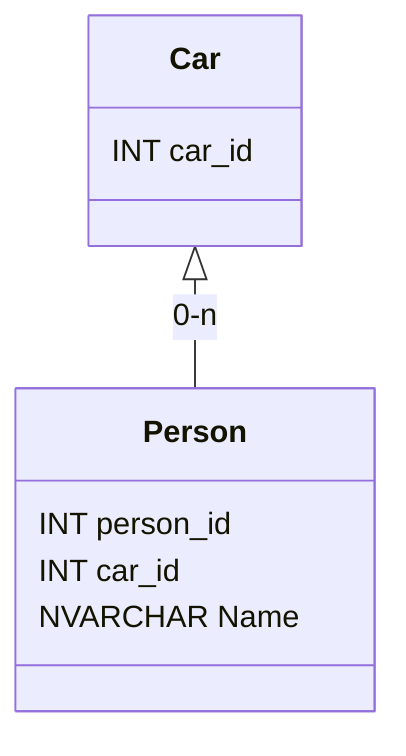
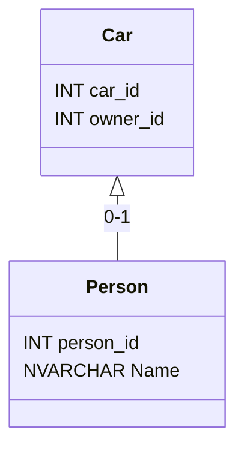

# Release Notes

### 2.0.0-preview

- First preview version

---

> **Warning**
> The documentation is in progress 😅, Please be patient for a few days.

# Summary

- [Release Notes](#release-notes)
- [Introduction](#introduction)
- [Prerequisites](#prerequisites)
- [Limitations](#limitations)
- [Installation](#installation)
- [How to use it?](#how-to-use-it)
   - [Different object types supported](#different-object-types-supported)
   - [Initialization](#initialization)
   - [Select](#select)
      - [Select with LazyBase type or object type](#select-with-lazybase-type-or-object-type)
      - [Select with dynamic type](#select-with-dynamic-type)
   - [Update](#update)
      - [Update with LazyBase type or object type](#update-with-lazybase-type-or-object-type)
      - [Update with dynamic type](#update-with-dynamic-type)
   - [Delete](#delete)
      - [Delete with LazyBase type or object type](#delete-with-lazybase-type-or-object-type)
      - [Delete with dynamic type](#delete-with-dynamic-type)
    - [Stored Procedure](#stored-procedure)
    - [Other Queries](#other-queries)
    - [Sql Functions](#sql-functions)
- [License](#license)


# Introduction

> **Warning**
> This project is at the "preview" stage, which is why it is not recommended to use it in a production environment. In addition, some major changes may occur between two minor versions. 

LazySql is a micro ORM that aims to facilitate access to a SQL-Server database.

This library provides a minimal implementation for simple use.

# Prerequisites

## .NET

|             | **.NET** | **.NET Framework** | **.NET Standard** |
|-------------|:-------------:|:------------------:|:-----------------:|
| **Version** |      6.0      |         4.8        |        2.0        |

## Sql Server

Minimum version: Sql Server 2012

# Limitations

Due to its simplified design, certain types of queries cannot be performed (such as joins). In addition, transactions are not supported.

Voici les fonctionnalités implémentées:

| **Type of query**                             | **Supported** | **Comment**          |
|-----------------------------------------------|:-------------:|----------------------|
| **Standard queries (SELECT, UPDATE, DELETE)** |       🟢       |                     |
| **Bulk Insert**                               |       🟢       |                     |
| **Stored Procedures**                         |       🟢       |                     |
| **Views**                                     |       🟢       |                     |
| **User-Defined SQL Functions**                |       🔴       | Nothing planned      |

Here are the supported functions: [Sql Functions](#sql-functions)

# Installation

Use nuget 😉: https://www.nuget.org/packages/LazySqlStandard.Engine/ 

# How to use it?

Here is an example of code to retrieve all cars with an Id less than 10 and update them.

```cs
LazyClient.Initialize("Server=my-server\SQL2019;Database=MyDataBase;");

foreach (Car car in LazyClient.Select<Car>().Where(c=>c.Id < 10) {
   car.UpdateDate = DateTime.Now;
   car.Update();
}
```

It's simple, right? As you can see, you can write your queries in Linq (or Expression), and LazySql will translate them into SQL 💪🏽.

## Different object types supported

You can use LazySql with classes, records or dynamic type, the engine uses the properties (which must be public) to read or write values.

However, just using objects can cause problems with using primary keys for example (in order to update or delete the object), or you may want to rename the columns differently in your C# code. This is why you can implement the LazyBase class and the attributes dedicated to mapping and defining primary keys.

### Object implementing the LazyBase class

As described above, the implementation of the LazyBase class allows you to define the table name, column names, primary keys, and parent/child relationship.

Here is an example that summarises a configuration with all possible attributes.

```cs
[LazyTable("Cars")]
public class Car : LazyBase
{
    [LazyColumn("car_id", SqlType.Int)]
    [PrimaryKey(true)]
    public int Id { get; set; }

    [LazyColumn(SqlType.VarChar)]
    public string Brand { get; set; }

    [LazyColumn(SqlType.VarChar)]
    public string Model { get; set; }

    [LazyColumn("owner_id", SqlType.VarChar)]
    public string OwnerId { get; set; }

    public List<Person> Passengers { get; set; }
    
    public Person Owner { get; set; }

    public override void InitializeTable()
    {
        AddOneToMany<Car, Person>(nameof(Passengers), expression: (p, c) => p.Id == c.ParentId);
        AddOneToOne<Car, Person>(nameof(Owner), (p, e) => p.ExtendedKey == e.Key);
    }
}
```

#### **LazyTable Attribute**

```cs
[LazyTable("Cars")]
```

This attribute is used to define the name of the table. If it is not present, then LazySql will use the class name as the table name in Sql.

#### **PrimaryKey Attribute**

```cs
[PrimaryKey(true)]
```

Defines a primary key. You can choose several properties if needed. The argument (boolean), allows to say if this key is autoincremented or not.

#### **LazyColumn Attribute**

```cs
[LazyColumn("owner_id", SqlType.VarChar)]
```

Defines a column. The first argument is the name of the column in SQL, if it is not filled in then LazySql will use the property name. The second argument is the data type in SQL.

#### **Relations**

You have the ability to define parent/child relationships between your objects. Defining these relationships allows LazySql to automatically load the child data with a select.

To do this you simply override the <code>InitializeTable</code> method and declare the existing relationships.

Il existe deux types de relations:

#### **Relation 1 <=> 0,n**

Here is an example of a relationship of a parent and several children with the diagram below:



Thus we define that a car can have 0 or more passengers.

In the ``Car`` class, we therefore have a property of type ``List<Person>``. To perform the binding, we need to use the ``AddOneToMany`` method. This method requires two generic types, the first type corresponding to the type of the parent object in the relationship (in our case ``Car``), the second type corresponds to the type of the child object (in our case ``Person``). Then, two arguments are needed, the first one is the name of the property of type ``List<T>`` which will contain the children, the second argument is the expression which joins the parent object and the children.

> **Note**
> The child object may not derive from the abstract class ``LazyBase``.

So we have the following C# code:

```cs
[LazyTable("Cars")]
public class Car : LazyBase
{
    // Parent Key
    [LazyColumn("car_id", SqlType.Int)]
    [PrimaryKey(true)]
    public int Id { get; set; }

    // List of Passengers
    public List<Person> Passengers { get; set; }

    public override void InitializeTable()
    {
        AddOneToMany<Car, Person>(nameof(Passengers), (car, person) => car.Id == person.CarId);
    }
}

[LazyTable("Persons")]
public class Person : LazyBase
{
    // Parent Key
    [LazyColumn("person_id", SqlType.Int)]
    [PrimaryKey(true)]
    public int Id { get; set; }

    [LazyColumn("car_id", SqlType.Int)]
    public int CarId { get; set; }

    [LazyColumn(SqlType.NVarchar)]
    public string Name { get; set; }
}
```

Subsequently, to retrieve the data:

```cs

foreach(Car car in LazyClient.Select<Car>())
{
    Console.WriteLine($"The Car {car.Id} has {car.Passengers.Count} passengers.");
    foreach(Person person in car.Passengers)
    {
        Console.WriteLine($"\t- {person.Name}");
    }
}
```

> **Note**
> To retrieve the data LazySql will perform two SQL queries. A first one to retrieve the parents, then a second one to retrieve all the children (with a WHERE filter).

#### **Relation 1 <=> 0,1**

Here is an example of a relationship of a parent and one child with the diagram below:



Thus we define that a car can have 0 or one owner.

In the ``Car`` class, we therefore have a property of type ``Person``. To perform the binding, we need to use the ``AddOneToOne`` method. This method requires two generic types, the first type corresponding to the type of the parent object in the relationship (in our case ``Car``), the second type corresponds to the type of the child object (in our case ``Person``). Then, two arguments are needed, the first one is the name of the property of type which will contain the children, the second argument is the expression which joins the parent object and the child.

> **Note**
> The child object may not derive from the abstract class ``LazyBase``.

So we have the following C# code:

```cs
[LazyTable("Cars")]
public class Car : LazyBase
{
    // Parent Key
    [LazyColumn("car_id", SqlType.Int)]
    [PrimaryKey(true)]
    public int Id { get; set; }

    [LazyColumn("owner_id", SqlType.Int)]
    public int? OwnerId {get;set;}
    public Person Owner { get; set; }

    public override void InitializeTable()
    {
        AddOneToOne<Car, Person>(nameof(Owner), (car, person) => car.OwnerId == person.Id);
    }
}

[LazyTable("Persons")]
public class Person : LazyBase
{
    // Parent Key
    [LazyColumn("person_id", SqlType.Int)]
    [PrimaryKey(true)]
    public int Id { get; set; }

    [LazyColumn(SqlType.NVarchar)]
    public string Name { get; set; }
}
```

Subsequently, to retrieve the data:

```cs

foreach(Car car in LazyClient.Select<Car>())
{
    Console.WriteLine($"The Car {car.Id} has the owner: {(car.Owner?.Name ?? "Empty")}");
}
```

> **Note**
> To retrieve the data LazySql will perform two SQL queries. A first one to retrieve the parents, then a second one to retrieve the child (with a WHERE filter).

### Object

### Dynamic

## Initialization

## Select

### Select with LazyBase type or object type

### Select with dynamic type

## Update

### Update with LazyBase type or object type

### Update with dynamic type

## Delete

### Delete with LazyBase type or object type

### Delete with dynamic type

## Stored Procedure

## Bulk Insert

### Select with LazyBase type or object type

### Select with dynamic type

## Other Queries

## Sql Functions

### Data Types

| **Data Type**                  | **Supported** | **Comment**     |
|--------------------------------|:-------------:|-----------------|
| bigint                         |       🟢      |                 |
| numeric                        |       🟢      |                 |
| bit                            |       🟢      |                 |
| smallint                       |       🟢      |                 |
| decimal                        |       🟢      |                 |
| smallmoney                     |       🟢      |                 |
| int                            |       🟢      |                 |
| tinyint                        |       🟢      |                 |
| money                          |       🟢      |                 |
| float                          |       🟢      |                 |
| real                           |       🟢      |                 |
| date                           |       🟢      |                 |
| datetimeoffset                 |       🟢      |                 |
| datetime2                      |       🟢      |                 |
| smalldatetime                  |       🟢      |                 |
| datetime                       |       🟢      |                 |
| time                           |       🟢      |                 |
| char                           |       🟢      |                 |
| varchar                        |       🟢      |                 |
| text                           |       🟢      |                 |
| nchar                          |       🟢      |                 |
| nvarchar                       |       🟢      |                 |
| ntext                          |       🟢      |                 |
| binary                         |       🟢      |                 |
| varbinary                      |       🟢      |                 |
| image                          |       🟢      |                 |
| hierarchyid                    |       🔴      | Nothing planned |
| uniqueidentifier               |       🟢      |                 |
| xml                            |       🟢      |                 |
| Spatial Geometry Types         |       🔴      | Nothing planned |
| Spatial Geography Types        |       🔴      | Nothing planned |

### Sql Functions

| **Function Name** | **C# Compatibility** | **Supported** | **Comment / Example**     |
|-------------------|-------------|:-------------:|-----------------|
|             |          **Date Functions**           ||
| `DATEADD`    |                    |       🟢      |     `LzFunctions.DateAdd(LzDatePart.Year, 1, o.MyDate)`            |
| `DATEDIFF`    |                       |       🟢      |   `LzFunctions.DateDiff(LzDatePart.Year, end, start)`              |
| `DATENAME`    |                       |       🟡      | In Progress     |
| `DATEPART`    |                       |       🟡      | In Progress     |
| `DAY`    |                            |       🟢      |  `LzFunctions.Day(date)`               |
| `GETDATE`    |                        |       🟢      | `LzFunctions.GetDate()`                |
| `GETUTCDATE`    |                     |       🟡      | In Progress     |
| `ISDATE`    |                         |       🟢      | `LzFunctions.IsDate("2002/12/31")`                |
| `MONTH`    |                          |       🟢      | `LzFunctions.Month(date)`                |
| `SYSDATETIME`    |                    |       🟡      | In Progress     |
| `YEAR`    |                           |       🟢      |  `LzFunctions.Year(date)`               |
|             |          **String Functions**           ||
| `ASCII`    |                           |       🟢      | `LzFunctions.Ascii("A")`                |
| `CHAR`    |                            |       🟢      | `LzFunctions.Char(72)`                |
| `CHARINDEX`    | <ul><li>`+`</li><li>`String.Format`</li><li>`$` (string interpolation)</li></ul>                    |       🟢      | `"$Username N°{id}"`                |
|`CONCAT_WS`    | `String.Join()`                   |       🟢      | `String.Join()`                |
| `DATALENGTH`    |                      |       🟢      | `LzFunctions.DataLength(s.Username)`                |
| `DIFFERENCE`    |                      |       🟡      | In Progress     |
| `FORMAT`    |                          |       🟡      | In Progress     |
| `LEFT`    |                            |       🟡      | In Progress     |
| `LEN`    |                             |       🟡      | In Progress     |
| `LOWER`    |                           |       🟡      | In Progress     |
| `LTRIM`    |                           |       🟡      | In Progress     |
| `NCHAR`    |                           |       🟡      | In Progress     |
| `PATINDEX`    |                        |       🟡      | In Progress     |
| `QUOTENAME`    |                       |       🟡      | In Progress     |
| `REPLACE`    |                         |       🟡      | In Progress     |
| `REPLICATE`    |                       |       🟡      | In Progress     |
| `REVERSE`    |                         |       🟡      | In Progress     |
| `RIGHT`    |                           |       🟡      | In Progress     |
| `RTRIM`    |                           |       🟡      | In Progress     |
| `SOUNDEX`    |                         |       🟡      | In Progress     |
| `SPACE`    |                           |       🟡      | In Progress     |
| `STR`    |                             |       🟡      | In Progress     |
| `STUFF`    |                           |       🟡      | In Progress     |
| `SUBSTRING`    |                       |       🟡      | In Progress     |
| `TRANSLATE`    |                       |       🟡      | In Progress     |
| `TRIM`    |                            |       🟡      | In Progress     |
| `UNICODE`    |                         |       🟡      | In Progress     |
| `UPPER`    |                           |       🟡      | In Progress     |
|             |          **Math/Numeric Functions**           ||
| `ABS`    |                             |       🟡      | In Progress     |
| `ACOS`    |                            |       🟡      | In Progress     |
| `ASIN`    |                            |       🟡      | In Progress     |
| `ATAN`    |                            |       🟡      | In Progress     |
| `ATN2`    |                            |       🟡      | In Progress     |
| `AVG`    |                             |       🟡      | In Progress     |
| `CEILING`    |                         |       🟡      | In Progress     |
| `COUNT`    |                           |       🟡      | In Progress     |
| `COS`    |                             |       🟡      | In Progress     |
| `COT`    |                             |       🟡      | In Progress     |
| `DEGREES`    |                         |       🟡      | In Progress     |
| `EXP`    |                             |       🟡      | In Progress     |
| `FLOOR`    |                           |       🟡      | In Progress     |
| `LOG`    |                             |       🟡      | In Progress     |
| `LOG10`    |                           |       🟡      | In Progress     |
| `MAX`    |                             |       🟡      | In Progress     |
| `MIN`    |                             |       🟡      | In Progress     |
| `PI`    |                              |       🟡      | In Progress     |
| `POWER`    |                           |       🟡      | In Progress     |
| `RADIANS`    |                         |       🟡      | In Progress     |
| `RAND`    |                            |       🟡      | In Progress     |
| `ROUND`    |                           |       🟡      | In Progress     |
| `SIGN`    |                            |       🟡      | In Progress     |
| `SIN`    |                             |       🟡      | In Progress     |
| `SQRT`    |                            |       🟡      | In Progress     |
| `SQUARE`    |                          |       🟡      | In Progress     |
| `SUM`    |                             |       🟡      | In Progress     |
| `TAN`    |                             |       🟡      | In Progress     |
|             |          **Advanced Functions**           ||
| `CAST`    |                            |       🟡      | In Progress     |
| `COALESCE`    |                        |       🟡      | In Progress     |
| `CONVERT`    |                         |       🟡      | In Progress     |
| `CURRENT_USER`    |                    |       🟡      | In Progress     |
| `IIF`    |                             |       🟡      | In Progress     |
| `ISNULL`    |                          |       🟡      | In Progress     |
| `ISNUMERIC`    |                       |       🟡      | In Progress     |
| `NULLIF`    |                          |       🟡      | In Progress     |
| `SESSION_USER`    |                    |       🟡      | In Progress     |
| `SESSIONPROPERTY`    |                 |       🟡      | In Progress     |
| `SYSTEM_USER`    |                     |       🟡      | In Progress     |
| `USER_NAME`    |                       |       🟡      | In Progress     |


```cs
Console.WriteLine("Fenced code blocks ftw!");
```
